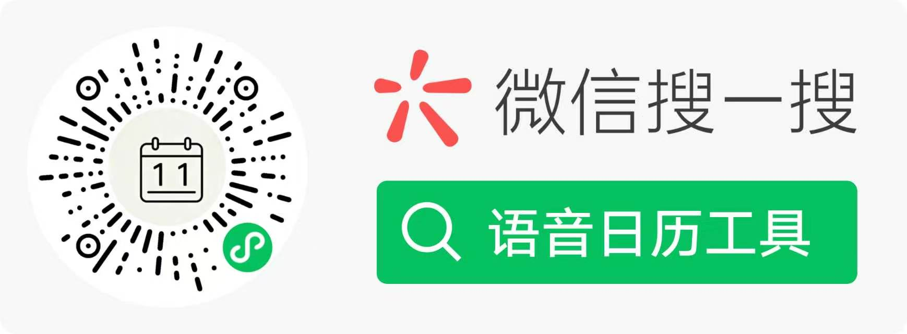
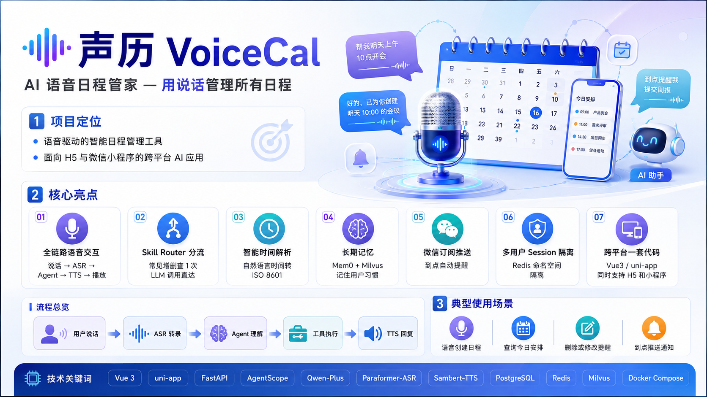
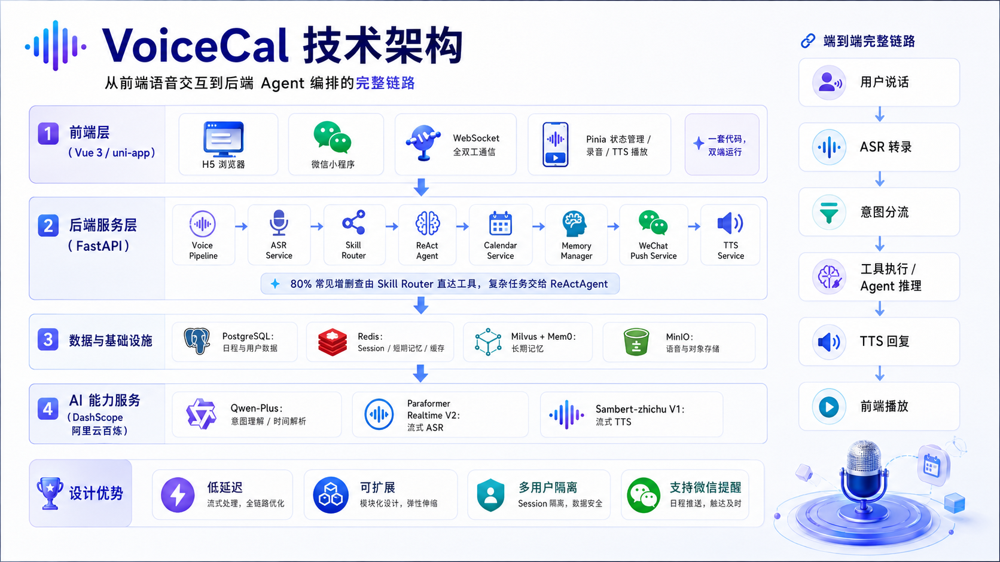
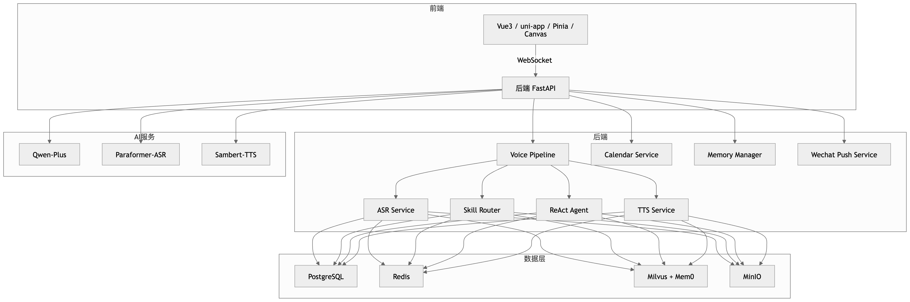

# 声历 VoiceCal

**AI 语音日程管家 — 用说话管理所有日程**

**作品讲解视频：[https://pan.baidu.com/s/1Y6OfzrUhUrX5K0JkRvPKJg?pwd=6z9o ](https://pan.baidu.com/s/1Y6OfzrUhUrX5K0JkRvPKJg?pwd=6z9o)**

> 🔗 **浏览器体验：[https://latekin.jufu.vip](https://latekin.jufu.vip)**
>
> 📱 **微信小程序**：扫码体验（ICP 备案审核中，暂未正式上线，可通过体验版使用）
>
> 
>
> ⚠️ 小程序备案审核完成时间不确定，若扫码无法体验，可使用浏览器端完整体验。

---

**前后端一体的语音日历系统。** 前端提供微信小程序（及 H5 联调）的日历界面与语音交互；后端提供 ASR、Agent 推理、日程 CRUD、TTS 与微信推送。用户用自然语言管理日程，两端通过 REST 与 WebSocket 协同完成完整体验。

---

## 效果展示







---

## 产品能力（前后端分工）

| 用户感知               | 前端职责                         | 后端职责                                 |
| ---------------------- | -------------------------------- | ---------------------------------------- |
| 语音添加/查询/改删日程 | 录音、会话 UI、TTS 播放          | ASR 转写、Agent 理解、工具调用、TTS 合成 |
| 日历浏览               | 月/年视图、节假日、事件列表      | 按时间范围查询 events 表                 |
| 手动编辑日程           | 表单、详情页、左滑操作           | REST CRUD、字段校验                      |
| 到点提醒               | 订阅消息授权、提醒字段展示       | 定时扫描、微信推送                       |
| 登录鉴权               | 微信登录、Token 缓存、请求头注入 | JWT 签发、openid 绑定用户                |

**语音对话（前后端协同）**

1. 前端：「开始对话」→ 录音 →「说完了」→ 上传 PCM 或分片。
2. 后端：转写 → Agent 调工具 → 返回 `agent.reply` + `tts.chunk` + `turn.done`。
3. 前端：展示回复、播完 TTS 后再开麦；增删改后结束会话，查询后可继续追问。
4. 后端：`need_confirm` 时等待用户说「确认/取消」触发的文本消息。

**日历能力（前后端协同）**

前端渲染月视图、年视图、事件详情与表单；后端持久化 `events` 表（标题、起止时间、全天、地点、描述、提醒字段等），HTTP 与 Agent 工具共用同一套 `CalendarService`。

---

## 全栈架构

```
┌──────────────────────── frontend/ ────────────────────────┐
│  页面：index · year-view · day-events · event-detail ·    │
│        settings                                           │
│  组件：CalendarView · EventList · GlobalVoice ·           │
│        VoiceInteractionLayer · EventFormModal           │
│  逻辑：useVoiceInteraction · useVoiceWsClient ·           │
│        useVoiceRecorder · VoiceTtsPlayer                  │
│  状态：Pinia（voice / calendar / websocket / user）      │
└─────────────────────────┬─────────────────────────────────┘
                          │
          ┌───────────────┴───────────────┐
          │  HTTP JSON          WebSocket JSON │
          │  Authorization      ?token=JWT     │
          └───────────────┬───────────────┘
┌─────────────────────────▼─────────────────────────────────┐
│  backend/                                                 │
│  API：auth · events · agent/text · health · subscribe     │
│  WS：/ws/voice（audio_start/chunk/end · text.message）    │
│  服务：CalendarService · CalendarAgentService · ASR/TTS   │
│        · session_service · wechat_push_service            │
│  工具：calendar_tools（增删改查 · 时间解析 · 冲突检测）   │
│  存储：PostgreSQL · Redis（会话，可降级内存）             │
└───────────────────────────────────────────────────────────┘
```

---

## 前端（frontend）

### 技术栈

uni-app · Vue 3 · Pinia · Vite · Sass

### 页面

| 页面                 | 功能                                  |
| -------------------- | ------------------------------------- |
| `pages/index`        | 月历、当日事件、全局语音入口          |
| `pages/year-view`    | 年视图                                |
| `pages/day-events`   | 某日全部事件                          |
| `pages/event-detail` | 详情、编辑、删除                      |
| `pages/settings`     | 权限、订阅提醒、API/WS 配置、使用引导 |

### 语音模块

| 模块                                    | 作用                                        |
| --------------------------------------- | ------------------------------------------- |
| `GlobalVoice` / `RecordButton`          | 底部「开始对话 / 说完了 / 结束对话」        |
| `VoiceInteractionLayer` / `VoiceStatus` | 遮罩、聆听/思考/播报状态                    |
| `useVoiceInteraction`                   | 会话状态机、静音检测、确认流、播报等待      |
| `useVoiceWsClient`                      | WS 协议、TTS 分片缓冲、turn.done 后等待播完 |
| `useVoiceRecorder`                      | 小程序 PCM 整段 / H5 AudioWorklet 分片      |
| `VoiceTtsPlayer`                        | 流式 PCM 24kHz 播放                         |

语音状态：`idle → recording → thinking → speaking → auto_listening → idle`

### HTTP 客户端

`api/events.js` · `api/auth.js` · `api/wechat.js` · `utils/request.js` — 与后端 REST 对齐，JWT 鉴权。

### 运行

```bash
cd frontend
npm install
npm run dev:mp-weixin   # 微信开发者工具打开 dist/dev/mp-weixin
npm run dev:h5
```

配置 `src/config/api.js` 中的 `API_BASE_URL`、`WS_BASE_URL`。

---

## 后端（`backend/`）

### 技术栈

FastAPI · Uvicorn · AgentScope · SQLAlchemy（async）· PostgreSQL · Redis · DashScope（ASR/TTS/LLM）· APScheduler

### HTTP 接口

| 路径                                | 说明                       |
| ----------------------------------- | -------------------------- |
| `GET /api/health`                   | 健康检查                   |
| `POST /api/auth/wechat-login`       | 微信小程序登录             |
| `POST /api/auth/dev-login`          | 开发环境登录               |
| `GET/POST/PUT/DELETE /api/events`   | 日程 CRUD                  |
| `POST /api/agent/text`              | 文本调试 Agent（不走语音） |
| `POST /api/wechat/subscribe-result` | 订阅消息授权结果           |

### WebSocket `/ws/voice`

| 客户端 → 服务端                             | 服务端 → 客户端                         |
| ------------------------------------------- | --------------------------------------- |
| `audio_start` / `audio.chunk` / `audio.end` | `transcription`                         |
| `text.message`                              | `agent.reply`（`text`, `need_confirm`） |
|                                             | `tts.chunk`（base64 PCM）               |
|                                             | `turn.done` / `error`                   |

处理流程：`audio.end` → ASR → `CalendarAgentService.handle_text` → 推送回复与 TTS → `turn.done`。

### Agent 与工具

`CalendarAgentService`（ReActAgent + 通义模型）注册 `calendar_tools`：

- 读：`query_calendar_events`、`get_event_by_id`
- 写：`add_calendar_event`、`create_reminder`、`update_calendar_event`、`delete_calendar_event`
- 辅助：`parse_datetime`、`check_time_conflict`、`detect_duplicate_events`、`suggest_available_slots`

写操作可返回 `CONFIRM_REQUIRED` / 冲突 / 重复，Agent 转为确认话术；用户确认后带 `confirm` 再次调用落库。

### 目录要点

```
backend/app/
├── api/          # HTTP + WebSocket 路由
├── agents/       # Agent 封装
├── services/     # 日历、Agent、ASR/TTS、会话、推送
├── tools/        # Agent 可调用的日历工具
├── models/       # SQLModel / ORM
└── schemas/      # Pydantic 请求响应
```

### 运行

```bash
cd backend
cp .env.example .env
docker compose up -d
pip install -r requirements.txt
uvicorn app.main:app --reload --host 0.0.0.0 --port 8000
```

- Swagger：`http://localhost:8000/docs`
- WS：`ws://localhost:8000/ws/voice?token=<jwt>`

---

## 前后端协作要点

| 主题     | 约定                                                                          |
| -------- | ----------------------------------------------------------------------------- |
| 身份     | JWT 载荷含 `openid`；HTTP 用 `Authorization: Bearer`；WS 用 `?token=`         |
| 日程数据 | 前端 `event-mapper` 与后端 `EventCreate/EventUpdate` 字段对齐                 |
| 语音会话 | 同一 `session_id` 贯穿多轮 WS 消息                                            |
| TTS 时序 | 前端在收到带 `text` 的 `agent.reply` 后开始播放；`turn.done` 后等待播完再开麦 |
| 联调     | 后端 `tests/frontend/voice_ws_test.html` 可独立测 WS；前端 H5 用 `dev-login`  |

---

## 仓库结构

```
calendar/
├── frontend/     # uni-app 前端
├── backend/      # FastAPI + Agent 后端
└── README.md
```

---

## 文档索引

| 文档                                       | 内容                |
| ------------------------------------------ | ------------------- |
| [frontend/README.md](frontend/README.md)   | 前端功能与模块      |
| [backend/docs/api.md](backend/docs/api.md) | 完整 HTTP / WS 协议 |
| [backend/README.md](backend/README.md)     | 后端结构摘要        |
| [backend/AGENTS.md](backend/AGENTS.md)     | 后端开发约定        |

---

_声历 v1.0 · 前端体验 + 后端智能，共同构成语音日历产品_
